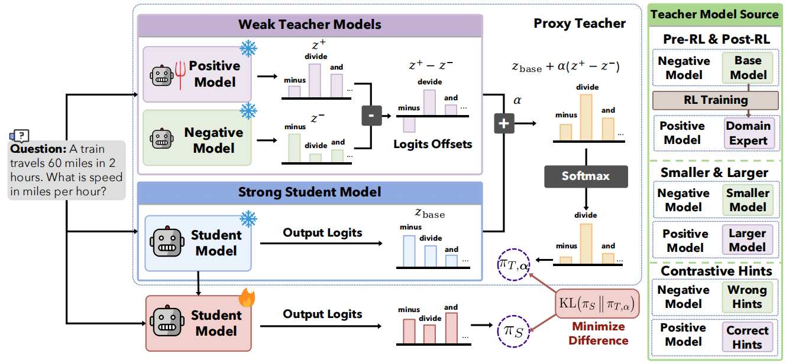

<h1 align="center">
  W2S-OPD: Weak-to-Strong On-Policy Distillation
</h1>

<p align="center">
  📄 <a href="https://w2s-opd.github.io"><strong>Paper</strong></a> |
  🌐 <a href="https://w2s-opd.github.io"><strong>Project Page</strong></a>
</p>

<p align="center">
  <a href="https://yu-fangxu.github.io/">Fangxu Yu</a><sup>1</sup>,
  <a href="https://zinanlin.me/">Zinan Lin</a><sup>2</sup>,
  <a href="https://xiaodongagi.github.io/">Xiaodong Liu</a><sup>2</sup>,
  <a href="https://weijia-xu.github.io/">Weijia Xu</a><sup>2</sup>,
  <a href="https://www.microsoft.com/en-us/research/people/michaelxu/">Michael Xu</a><sup>2</sup>,
  <a href="https://tianyizhou.github.io/">Tianyi Zhou</a><sup>3</sup>,
  <a href="https://www.microsoft.com/en-us/research/people/jfgao/">Jianfeng Gao</a><sup>2</sup>
</p>

<p align="center">
  <sup>1</sup>University of Maryland, College Park &nbsp;
  <sup>2</sup>Microsoft Research &nbsp;
  <sup>3</sup>Mohamed Bin Zayed University of Artificial Intelligence
</p>



## 🔥 Overview

**W2S-OPD** improves a **strong student** by distilling it from **multiple weak models**, none of
which is as capable as the student overall. On-policy distillation (OPD) delivers dense, on-policy
token-level supervision, but presupposes a teacher at least as capable as the student — which fails
at the frontier (no larger teacher exists) or requires costly experts trained at the student's scale.

W2S-OPD removes that premise. Given a **stronger positive** model and a **weaker negative** model, their
**logit difference** isolates the *capability direction* that separates them. Adding this direction onto
the student's own base model yields a **proxy teacher** that couples the capability while staying
**distributionally adjacent** to the student. The student distills it by minimizing the per-position
reverse KL on its own rollouts.

```
z_proxy = z_student_base  +  α · ( z_positive − z_negative )      # composed in logit space
teacher = softmax(z_proxy)
```

## 🚀 Key Features

- 🧩 **Proxy teacher in logit space**: build a teacher stronger than any single weak model by adding a
  contrast direction `α·(z₊ − z₋)` onto the student's base — no teacher larger than the student needed.
- 🎛️ **Three interchangeable contrasts**: post-RL expert vs. its init, larger vs. smaller base, or a base
  model under correct vs. incorrect hints — swap via one env var, everything else fixed.
- 🔌 **Drop-in on [verl](https://github.com/volcengine/verl)**: FSDP + vLLM rollout, single/multi-node;
  only the teacher's per-position top-K distribution is exported to the student.

## 📥 Data & Models

> 🚧 **Data and model setup instructions are under internal review and will be released here once the review is complete.**

## 🎯 Training

> 🚧 **The training code is under internal review and will be released here once the review is complete.**

## 📊 Evaluation

> 🚧 **The evaluation code is under internal review and will be released here once the review is complete.**

## 📖 Citation

If you find this work useful, please cite:

```bibtex
@inproceedings{yu2026w2sopd,
  title     = {Weak-to-Strong On-Policy Distillation},
  author    = {Yu, Fangxu and Lin, Zinan and Liu, Xiaodong and Xu, Weijia and Xu, Michael and Zhou, Tianyi and Gao, Jianfeng},
  booktitle = {International Conference on Learning Representations (ICLR)},
  year      = {2026}
}
```
